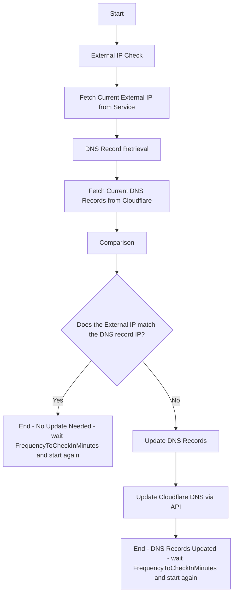

# Dynamic DNS Record Updater for Cloudflare

An application that automatically updates your Cloudflare DNS records with your current external IP address. This tool effectively turns your domain into a dynamic DNS, allowing you to access services hosted on a dynamic IP address.

## Overview

This tool periodically checks your external IP address and updates specified DNS records on Cloudflare if a change is detected. It's ideal for users with a dynamic IP address who need to maintain up-to-date DNS records without manual intervention.

## Features

- **Automated IP Detection**: Fetches your current external IP address using a reliable API.
- **Dynamic DNS Updates**: Updates your Cloudflare DNS records when your IP address changes.
- **Multiple Domain Support**: Configure multiple domains or subdomains to update simultaneously.
- **Configuration Flexibility**: Uses a `config.json` file for easy setup and supports environment variables for sensitive data.
- **Logging**: Provides detailed logs of operations and errors for easy troubleshooting.

## Prerequisites

- **.NET 6.0 SDK or higher**: Ensure you have the .NET SDK installed. You can download it from the [.NET website](https://dotnet.microsoft.com/download).

## Installation

1. **Clone the Repository**

   ```shell
   git clone https://github.com/SunsetQuest/Dynamic-DNS-Record-Updater-For-CloudFlare
   cd dynamic-dns-cloudflare
   ```

2. **Install Dependencies**

   Restore the NuGet packages required by the application:

   ```shell
   dotnet restore
   ```

## Configuration

### 1. Create a Cloudflare API Token

You need a Cloudflare API token with the following permissions:

- **Zone - DNS - Edit**

**Steps to Create an API Token:**

1. Log in to your Cloudflare dashboard
2. Navigate to **My Profile** > **API Tokens**.
3. Click on **Create Token**.
4. Use the **Edit DNS Zone** template or create a custom token with **Zone - DNS - Edit** permissions.
5. Restrict the token to the specific zone (domain) you want to update.
6. Copy the generated API token and keep it secure.

### 2. Prepare the Configuration File

Create a `config.json` file in the application directory or a custom location.

**Example `config.json`:**

```json
{
  "ZoneId": "your_zone_id",
  "ApiToken": "your_api_token", // Optional: It's recommended to use the environment variable for better security
  "Domains": [ "yourdomain.com", "subdomain.yourdomain.com" ],
  "FrequencyToCheckInMinutes": 120
}
```

**Notes:**

- **ZoneId**: Your Cloudflare Zone ID, found in the dashboard under **Overview**.
- **ApiToken**: Your Cloudflare API token. For security, it's recommended to set this via an environment variable.
- **Domains**: A list of domains or subdomains you wish to update.
- **FrequencyToCheckInMinutes**: How often (in minutes) the application checks for IP changes.

### 3. Set the API Token as an Environment Variable (Recommended)

Set the `CF_API_TOKEN` environment variable to securely provide your API token to the application.

**For Windows Command Prompt:**

```shell
set CF_API_TOKEN=your_api_token
```

**For Windows PowerShell:**

```powershell
$env:CF_API_TOKEN="your_api_token"
```

**For Linux/macOS Terminal:**

```shell
export CF_API_TOKEN=your_api_token
```

## Usage

### Running the Application

**Default Configuration File (`config.json` in the same directory):**

```shell
dotnet run
```

**Custom Configuration File Path:**

```shell
dotnet run -- -config /path/to/your/config.json
```

- The `--` indicates that the following arguments are for your application, not for `dotnet`.

### As a Compiled Executable

You can publish the application as a self-contained executable:

```shell
dotnet publish -c Release -r win-x64 --self-contained true
```

Replace `win-x64` with `linux-x64` or `osx-x64` depending on your operating system.

Run the published executable:

```shell
./bin/Release/net6.0/win-x64/publish/dynamic-dns-cloudflare.exe -config /path/to/your/config.json
```

## Logging

The application uses the built-in logging framework to provide informative messages. Logs include timestamps and indicate whether an operation was successful or if an error occurred.

## Error Handling

- The application will log errors and exit gracefully if:

  - The configuration file is missing or invalid.
  - Required configuration fields are missing.
  - There are issues connecting to the external IP service or Cloudflare API.

- Detailed error messages and stack traces are provided in the logs to assist with troubleshooting.

## Security Considerations

- **API Token**: Avoid storing your API token in the `config.json` file. Use environment variables to keep sensitive information secure.
- **Configuration File**: Ensure your `config.json` file is stored securely and not committed to version control if it contains sensitive data.

## Dependencies

- **Newtonsoft.Json**: For JSON parsing.
- **Microsoft.Extensions.Logging.Console**: For logging to the console.

Install these packages via NuGet:

```shell
dotnet add package Newtonsoft.Json
dotnet add package Microsoft.Extensions.Logging.Console
```

## Example Output

```
12:00:00 Information: Checking yourdomain.com to ensure it matches 203.0.113.10.
12:00:02 Information: yourdomain.com IP address matches. No update needed.
12:00:02 Information: Checking subdomain.yourdomain.com to ensure it matches 203.0.113.10.
12:00:03 Information: IP addresses do not match. Updating DNS record...
12:00:05 Information: subdomain.yourdomain.com DNS record updated successfully.
```

## Graphic Illustration


## Full Code Example

Here's the complete code for the application:

```csharp
// Dynamic DNS Record Updater for CloudFlare
// License: MIT license
// This tool was created to automatically update DNS records.
// Created by ChatGPT and Ryan Scott White

// Instructions:
//   1. Create an API token with the required permissions.
//   2. Set the ZoneId, ApiToken, Domains list, and FrequencyToCheckInMinutes in the config.json file.

using Microsoft.Extensions.Logging;  // Install-Package Microsoft.Extensions.Logging.Console
using Newtonsoft.Json;
using Newtonsoft.Json.Linq; // Install-Package Newtonsoft.Json
using System;
using System.Collections.Generic;
using System.IO;
using System.Net.Http;
using System.Net.Http.Headers;
using System.Text;
using System.Threading.Tasks;

public class Configuration
{
    public required string ZoneId { get; set; }
    public required string ApiToken { get; set; }
    public required List<string> Domains { get; set; }
    public int FrequencyToCheckInMinutes { get; set; }
}

public class Program
{
    private static ILogger<Program>? _logger;

    public static async Task Main(string[] args)
    {
        // Setup logging
        using ILoggerFactory loggerFactory = LoggerFactory.Create(builder =>
        {
            _ = builder.AddSimpleConsole(options =>
            {
                options.IncludeScopes = true;
                options.SingleLine = true;
                options.TimestampFormat = "hh:mm:ss ";
            });
            _ = builder.SetMinimumLevel(LogLevel.Information);
        });
        _logger = loggerFactory.CreateLogger<Program>();

        // Parse command-line arguments to get the configuration file path
        string configFilePath = "config.json"; // Default config file name
        if (args.Length > 0)
        {
            for (int i = 0; i < args.Length; i++)
            {
                if (args[i].Equals("-config", StringComparison.OrdinalIgnoreCase) && i + 1 < args.Length)
                {
                    configFilePath = args[i + 1];
                    break;
                }
            }
        }

        // Load configuration from file
        Configuration config = LoadConfiguration(configFilePath);

        // Validate configuration
        if (config == null || !ValidateConfiguration(config))
        {
            _logger.LogError("Configuration is missing or invalid. Exiting application.");
            return;
        }

        // Override ApiToken with environment variable if set
        string envApiToken = Environment.GetEnvironmentVariable("CF_API_TOKEN");
        if (!string.IsNullOrEmpty(envApiToken))
        {
            config.ApiToken = envApiToken;
            _logger.LogInformation("ApiToken loaded from environment variable.");
        }

        // Main loop
        string lastExternalIP = "";
        while (true)
        {
            if (lastExternalIP != "")
            {
                _logger.LogInformation("Waiting {Minutes} minutes.", config.FrequencyToCheckInMinutes);
                await Task.Delay(TimeSpan.FromMinutes(config.FrequencyToCheckInMinutes));
            }

            using HttpClient client = new();
            client.DefaultRequestHeaders.Authorization = new AuthenticationHeaderValue("Bearer", config.ApiToken);
            client.DefaultRequestHeaders.Accept.Add(new MediaTypeWithQualityHeaderValue("application/json"));

            // Get external IP address
            string newExternalIP = await GetExternalIPAddressAsync();
            if (string.IsNullOrEmpty(newExternalIP))
            {
                _logger.LogWarning("Failed to get external IP address.");
                continue;
            }

            // Check if IP has changed
            if (lastExternalIP == newExternalIP)
            {
                _logger.LogInformation("No changes detected in external IP ({IP}).", lastExternalIP);
                continue;
            }
            lastExternalIP = newExternalIP;

            // Check each domain
            foreach (string domain in config.Domains)
            {
                _logger.LogInformation("Checking {Domain} to ensure it matches {IP}.", domain, newExternalIP);

                string dnsRecordId = await GetDnsRecordIdByNameAsync(client, config.ZoneId, domain);
                if (string.IsNullOrEmpty(dnsRecordId))
                {
                    _logger.LogWarning("Failed to get DNS Record ID for domain ({Domain}).", domain);
                    continue;
                }

                string dnsRecordIp = await GetCloudFlareDnsRecordIpAsync(client, config.ZoneId, dnsRecordId);

                if (string.IsNullOrEmpty(dnsRecordIp))
                {
                    _logger.LogWarning("Failed to get IP address from DNS Record ID.");
                    continue;
                }

                if (newExternalIP != dnsRecordIp)
                {
                    _logger.LogInformation("IP addresses do not match. Updating DNS record...");
                    _logger.LogInformation("DNS Record IP: {DnsRecordIp}", dnsRecordIp);
                    _logger.LogInformation("External IP: {ExternalIp}", newExternalIP);

                    bool updateSuccess = await UpdateCloudFlareDnsRecordAsync(client, config.ZoneId, dnsRecordId, newExternalIP, domain);

                    _logger.LogInformation("{{Domain}} DNS record update Success: {UpdateSuccess}.", domain, updateSuccess);
                }
                else
                {
                    _logger.LogInformation("{Domain} IP address matches. No update needed.", domain);
                }
            }
        }
    }

    private static Configuration? LoadConfiguration(string filePath)
    {
        if (File.Exists(filePath))
        {
            try
            {
                string jsonConfig = File.ReadAllText(filePath);
                Configuration config = JsonConvert.DeserializeObject<Configuration>(jsonConfig);

                // Set default frequency if not specified
                if (config.FrequencyToCheckInMinutes <= 0)
                {
                    config.FrequencyToCheckInMinutes = 120; // Default to 120 minutes
                }

                return config;
            }
            catch (Exception ex)
            {
                _logger.LogError(ex, "Error reading configuration file.");
                return null;
            }
        }
        else
        {
            _logger.LogError("Configuration file not found: {FilePath}", filePath);
            return null;
        }
    }

    private static bool ValidateConfiguration(Configuration config)
    {
        bool isValid = true;

        if (string.IsNullOrEmpty(config.ZoneId))
        {
            _logger.LogError("ZoneId is missing in configuration.");
            isValid = false;
        }

        if (string.IsNullOrEmpty(config.ApiToken))
        {
            _logger.LogError("ApiToken is missing in configuration.");
            isValid = false;
        }

        if (config.Domains == null || config.Domains.Count == 0)
        {
            _logger.LogError("Domains list is missing or empty in configuration.");
            isValid = false;
        }

        return isValid;
    }

    private static async Task<string> GetExternalIPAddressAsync()
    {
        using HttpClient client = new();
        try
        {
            string ipAddress = (await client.GetStringAsync("https://api.ipify.org")).Trim();
            bool isValidIP = System.Net.IPAddress.TryParse(ipAddress, out System.Net.IPAddress ip) && ip.ToString() == ipAddress;
            if (!isValidIP)
            {
                _logger.LogWarning("Invalid IP address received: {IPAddress}", ipAddress);
                ipAddress = "";
            }

            return ipAddress;
        }
        catch (Exception ex)
        {
            _logger.LogError(ex, "Error getting external IP address.");
            return "";
        }
    }

    private static async Task<string> GetDnsRecordIdByNameAsync(HttpClient client, string zoneId, string recordName)
    {
        string url = $"https://api.cloudflare.com/client/v4/zones/{zoneId}/dns_records?type=A&name={Uri.EscapeDataString(recordName)}";

        try
        {
            HttpResponseMessage response = await client.GetAsync(url);
            string content = await response.Content.ReadAsStringAsync();

            if (!response.IsSuccessStatusCode)
            {
                _logger.LogError("Error fetching DNS Record ID. Status Code: {StatusCode}", response.StatusCode);
                _logger.LogError("Response Content: {Content}", content);
                return "";
            }

            JObject dnsRecords = JObject.Parse(content);
            JArray resultArray = (JArray)dnsRecords["result"];

            if (resultArray != null && resultArray.Count > 0)
            {
                JToken dnsRecord = resultArray[0];
                string dnsRecordId = dnsRecord["id"]?.ToString() ?? "";
                return dnsRecordId;
            }

            _logger.LogWarning("DNS record not found for {RecordName}.", recordName);
            return "";
        }
        catch (Exception ex)
        {
            _logger.LogError(ex, "Error retrieving DNS Record ID.");
            return "";
        }
    }

    private static async Task<string> GetCloudFlareDnsRecordIpAsync(HttpClient client, string zoneId, string dnsRecordId)
    {
        string url = $"https://api.cloudflare.com/client/v4/zones/{zoneId}/dns_records/{dnsRecordId}";

        try
        {
            HttpResponseMessage response = await client.GetAsync(url);
            string content = await response.Content.ReadAsStringAsync();

            if (!response.IsSuccessStatusCode)
            {
                _logger.LogError("Error fetching DNS Record IP. Status Code: {StatusCode}", response.StatusCode);
                _logger.LogError("Response Content: {Content}", content);
                return "";
            }

            // Parse the JSON response to extract the IP address
            JObject dnsRecord = JObject.Parse(content);
            string currentIp = dnsRecord["result"]?["content"]?.ToString() ?? "";

            return currentIp;
        }
        catch (Exception ex)
        {
            _logger.LogError(ex, "Error retrieving DNS Record IP.");
            return "";
        }
    }

    private static async Task<bool> UpdateCloudFlareDnsRecordAsync(HttpClient client, string zoneId, string dnsRecordId, string newIp, string domain)
    {
        string url = $"https://api.cloudflare.com/client/v4/zones/{zoneId}/dns_records/{dnsRecordId}";

        var payload = new
        {
            type = "A",
            name = domain,
            content = newIp,
            ttl = 3600,
            proxied = true,
            comment = "Dynamic DNS update"
        };

        string jsonPayload = JsonConvert.SerializeObject(payload);

        StringContent requestContent = new(jsonPayload, Encoding.UTF8, "application/json");

        try
        {
            HttpResponseMessage response = await client.PutAsync(url, requestContent);
            string responseContent = await response.Content.ReadAsStringAsync();

            if (!response.IsSuccessStatusCode)
            {
                _logger.LogError("Error updating DNS record. Status Code: {StatusCode}", response.StatusCode);
                _logger.LogError("Response Content: {Content}", responseContent);
                return false;
            }

            // Check if the update was successful
            JObject result = JObject.Parse(responseContent);
            return result["success"]?.ToObject<bool>() ?? false;
        }
        catch (Exception ex)
        {
            _logger.LogError(ex, "Error updating DNS record.");
            return false;
        }
    }
}
```

## Contributing

Contributions are welcome! Please submit a pull request or open an issue to discuss any changes or enhancements.

## License

This project is licensed under the MIT License. See the [LICENSE](LICENSE.TXT) file for details.

## Acknowledgments

- **ChatGPT**: Initial code generation and assistance.
- **Ryan Scott White**: Additional custom changes and project setup.

## Disclaimer

This tool is provided "as is" without warranty of any kind. Use it at your own risk.

---

*Note: Remember to replace placeholder values like `yourusername`, `your_zone_id`, `your_api_token`, and domain names with your actual information before using the application.*
